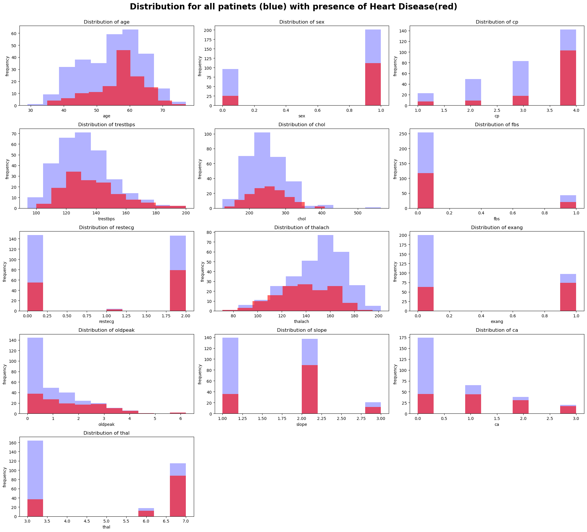
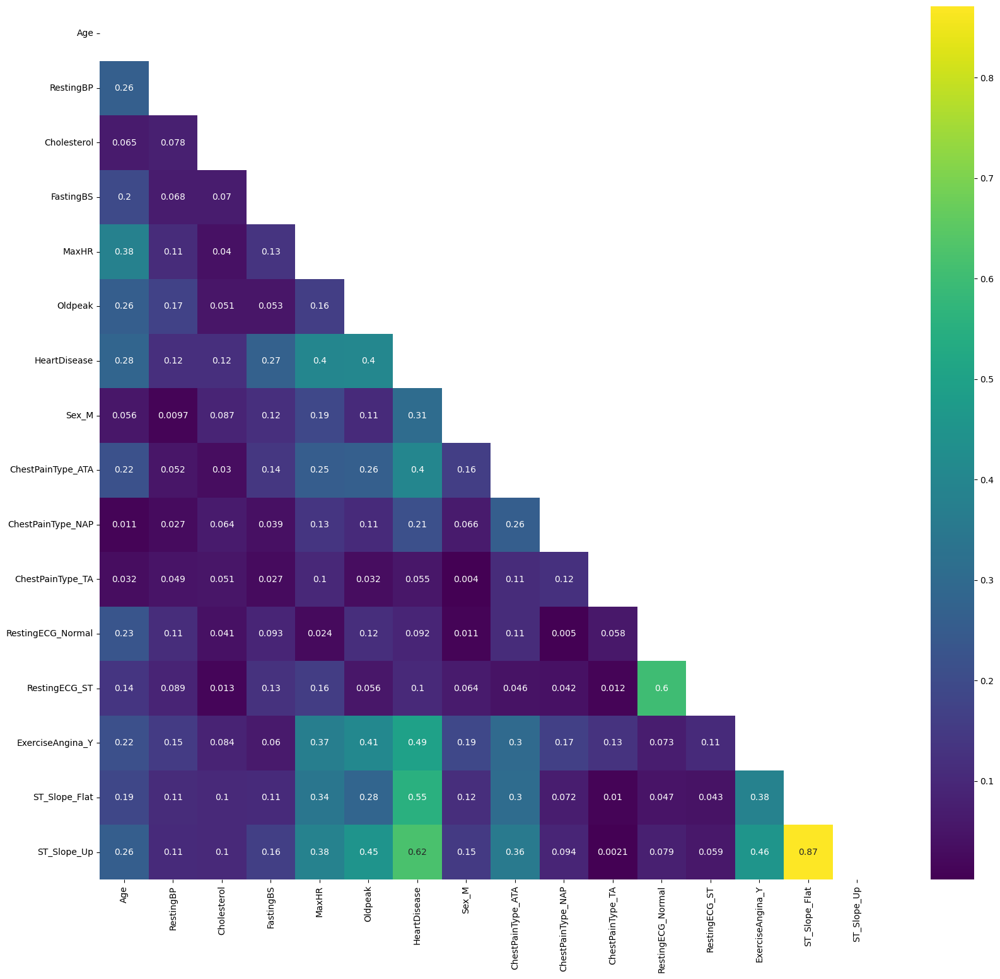
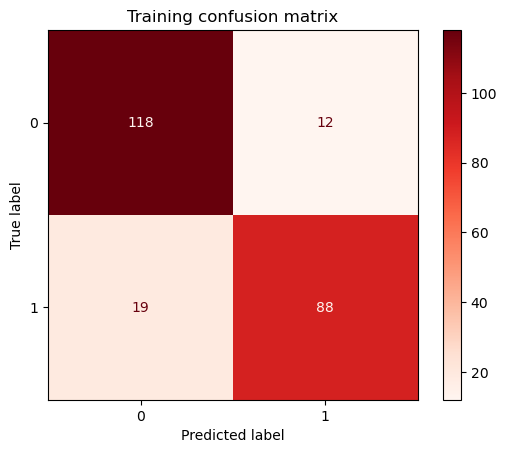
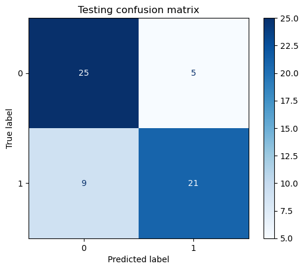

# Classification-and-Prediction-of-Heart-Diseases-Dataquest-Project
## Project Description 
This project leverages supervised learning techniques to analyze patient data and develop models that can classify and predict heart disease. By applying machine learning algorithms to structured datasets, the project addresses two primary goals:
   1. **Classification**: Identifying the presence of a heart disease in a individual based on various patient characteristics.
   2. **Prediction**: Estimating the risk of future heart-related events based on their medical history and clinical features,enabling more precise interventions.

Supervised learning methods are employed to train models on labeled data, enabling accurate classification and prediction. The models are designed to assist healthcare professionals in early diagnosis and personalized risk assessment, thus contributing to improved patient outcomes.The project focuses on building a Logistic Regression Classifier for classification of Heart Diseases and a K-Neighbors Classifier as the predictive model for the prediction task. 

## Background 
The presence of heart disease can be determined by analyzing various patient features, often referred to as risk factors or clinical indicators. These features can be grouped into demographic, lifestyle, clinical, and laboratory categories where some factors are controllable and others non-controllable.

Age and gender are some uncontrollable demographic factors. Lifestyle features such as physical activity, smoking and dietary habits are controllable risk factors according to the [CDC](https://www.cdc.gov/heart-disease/risk-factors/index.html#:~:text=Eating%20a%20diet%20high%20in,can%20lead%20to%20heart%20disease.).Some other indicators are clinical features such as blood pressure, cholesterol levels and laboratory features such as Fasting Blood Sugar(FBG), ECG results and also various symptoms reported by the patients such as chest pain types, fatigue or shortness of breath. 

## Data
A real-life [Heart Disease Dataset](https://archive.ics.uci.edu/dataset/45/heart+disease) collected from a UCI repository that contains various patient features is used for the classification task. The likelihood of getting a cardiovascular disease in the future is predicted using a [kaggle dataset](Data/heart_disease_prediction_kaggle.csv) which contains several demographic, clinical and laboratory data collected from patients. 

## Exploratory Data Analysis (EDA) 

### 1. Classification Task
Some insights gained from the EDA for the classification task were:

As shown in the correlation heatmap :[Correlation Heatmap](Images/classification_fig1.png) 
- Features `thal`,`ca`,`oldpeak`,`exang`,`cp`,`slope` have positive correlation with the **target variable** or outcome **`present`**.
- `thalach` variable has a negative correlation with the outcome **`present`**.
- Rest of the feature variables didn't show a much strong correlation with the target variable.

**Based on the distribution of each feature with the outcome, the features `thal`,`ca`,`oldpeak`,`exang`,`cp`,`slope`,`thalach` were selected as the predictors due to significance variability of their distribution with the target variable.**



### 2. Prediction Model 
Some insights gained from the EDA for the Prediction task were:

- Variables `RestingBP`,`Cholesterol`,`FastingBP`  have minimum value of zero which is very low and unlikely to happen.
- According to [American Heart Association](https://www.heart.org/en/health-topics/cholesterol/about-cholesterol/what-your-cholesterol-levels-mean)**Serum Cholesterol is**:
> composite of different measurements. Your total blood cholesterol is calculated by adding your HDL and LDL cholesterol levels, plus 20% of your triglyceride level.
- Since `Cholesterol` value contains serum Cholesterol , it is highly unlikely to have zero value for the cholesterol meassure.
- The median of the Cholesterol is around 25 mm/dl lesser than the mean/ middle quantile cholesterol value which is 223 mm/ld. This suggests a left skewed distribution with possible outliers causinig the skewness.
- Those variables having 'zero' values are imputed with the median value of the most relatable group made for that variable.
- The categorical variables were converted to dummy variables in order to identify the correlation of each category in those variables with the target varaible.
- Based on the correlation heatmap : 
   - `ST_Slope_Up`,`ST_Slope_Flat`,`ExerciseAngina_Y`,`Oldpeak`,`ChestPainType_ATA` are the top five features with highest correlation to the target varaiable,**`HeartDisease`**.
   - **Final selection of the features for model building were `ST_Slope_Up`,`ST_Slope_Flat`,`ExerciseAngina_Y`,`Oldpeak`,`ChestPainType_ATA`and `Sex_M`**.

## Model Building 

The necessary libraries that are used in this project are : 
``` python
import pandas as pd
import numpy as np 
import seaborn as sns
import matplotlib.pyplot as plt
from sklearn.model_selection import train_test_split,GridSearchCV
from sklearn.linear_model import LogisticRegression
from sklearn.preprocessing import StandardScaler,MinMaxScaler
from sklearn.metrics import confusion_matrix
from sklearn.metrics import ConfusionMatrixDisplay
from sklearn.neighbors import KNeighborsClassifier
```
### 1. Classification Model
The scikit-learn's Logistic Regression model was used to create the classifier using the following code: 
``` python
# Splliting the dataset to test and training data 
X=heart[['thal','ca','oldpeak','cp','slope','thalach']]
y=heart['present']
X_train,X_test,y_train,y_test=train_test_split(X,y,test_size=0.2, random_state=739)

#Check if the both test and training data reprsent both cases and non-cases of outcome
print('Test set :')
print(y_train.value_counts())
print('Trainig set:')
print(y_test.value_counts())

# Building a Logistic Rgression model 
model=LogisticRegression()
scaler=StandardScaler() #standardizing the feature dataset
X_train=scaler.fit_transform(X_train) 
X_test=scaler.transform(X_test)
model.fit(X_train,y_train) # Fit the traning data to the model
```
### 2. Prediction Task 
The scikit-learn's KNeighborsClassifier was used to create the predictive model using the following code: 
``` python

heart_clean=heart_df[['ST_Slope_Up','ST_Slope_Flat','ExerciseAngina_Y',
                      'Oldpeak','ChestPainType_ATA','Sex_M','HeartDisease']]

# Assigning feature dataset(x) and target variable(y)
X=heart_clean.drop('HeartDisease',axis=1)
y=heart_clean['HeartDisease']

# Split the dataset to training and validation datasets
X_train,X_val,y_train,y_val=train_test_split(X,y,test_size=0.2,random_state=417)

feature_list=list(X)
accuracies={}
# Evaluating the model using single feature at a time
for feature in feature_list:
    knn=KNeighborsClassifier(n_neighbors=10)
    knn.fit(X_train[[feature]],y_train)
    accuracy=knn.score(X_val[[feature]],y_val)
    accuracies[feature]=round(accuracy,2)*100
print(accuracies)

# Normalizing the data using the MinMaxScalar
scaler=MinMaxScaler() # Instantiate the scaler
X_train_scaled=scaler.fit_transform(X_train)
X_val_scaled=scaler.fit_transform(X_val)

# Evaluating the model using the scaled data on multiple features
knn=KNeighborsClassifier(n_neighbors=10)
knn.fit(X_train_scaled,y_train)
accuracy_2=knn.score(X_val_scaled,y_val)
print(f' The accuracy of the model trained on multiple features is {round(accuracy_2*100,2)}%')
```


## Model Evaluation 

### 1. Classification Model 

The performance of this binary classification  model was evaluated with model accuracy as well as statistical meassures sensitivity specificity,Positive Predictive Vaule(PPV) and Negative Predictive Value(NPV). Using these key metrics are important in medical diagnostics, where accurate classification of condition is critical.

**Sensitivity** measures how well a model identifies the positive cases correctly, which is meassured by the statistical formula: 

                        `Sensitivity = True Positives (TP) / [True Positives (TP) + False Negatives (FN)]`
                        
**Specificity** meassures how well a model identifies the negative cases correctly, which is meassured by the statistical formula: 

                        `Specificity= True Negatives (TN) / [True Negatives (TN) + False Positives (FP)]`

**Precision(PPV)** meassures the proportion of predicted positive cases that are actually positive.

                       `Precision(PPV)= True Positives (TP) / [True Positives (TP) + False Positives (FP)]`
**Negative Predictive Value(NPV)** meassures the proportion of negative predicted cases that are actually negative.

                        `Negative Predictive Values(NPV)= True Negatives(TN)/[True Negatives(TN) + False Negatives (FN)]`
          
Where:
- **TN (True Negatives)**: Correctly identified negative cases.
- **FP (False Positives)**: Negative cases incorrectly classified as positive.
- **TP (True Positives)**: Correctly identified positive cases.
- **FN (False Negatives)**: Positive cases incorrectly classified as negative.

The **training accuracy** of the model is **86.91 %**, while the **testing accuracy** is **76.7%** which is expected for a generalized model.

As shown in the confusion matrix obtained using training dataset the training **sensitivity** and training **specificity** are **82.2 %** and **90.76%** respectivly.



Based on the confusion matrix obtained using testing dataset, the testing **sensitivity** and testing **specificity** are **82.2 %** and **90.76%** respectivly, which were the same values obtained for the training dataset. The **Precision(PPV)** from the test dataset is **0.88** and **NPV** is **0.86**.



### 1. Prediction Model 

- `ST-Slope_Up` feature has the highest validation accuracy of **82%**,when model's performance was evaluated using a single feature at a time.
- The validation accuracy of the model gained when trained on multiple features is **82.97%**.
- GridSearchCV was used to experiment and find the best parameters and hyperparameters for the K-Neighbors model.
- The best training accuracy gained for any estimaor/model from the **GridSearchCV** is **83.95%**.
- **Test accuracy** of the best estimator with best model parameters selected by GridSearchCV is **84.1%**

## Conclusion

- In many cases, improving sensitivity may reduce specificity and vice versa.
- For the classification task having a higher sensitvity and precision(PPV) are crucial to understand the effectiveness of the system,because missing a diagnosis can be life-threatening.
- The effectivity of the predictors are meassured,based on the log-odds values calculated from the co-efficients of the logistic regression model.
- Aside all selected predictors,having a smaller odd-ratio for `thalach` suggests when the variable increases,the success probability decreases, which means less likelihood of getting a cardiac disease. Based on the domain knowledge it proves this finding is true, as healthier individuals can have higher `thalach` (meassured maximum heart rate).
 - The model accuracy of the predictive model is fairly good as it produce accurate prediction 84% of the time, although it's npt excellent to be used in practical healthcare setting due to 16% chance of predicting false negative or false positive results.
 - As preliminary response to a patients' cardiac health test, the built predictive model can be used to gain a fast prediction for the patient's probability of getting a cardiac disease,while keeping it for further investigation for most definete diagnosis of the results.


